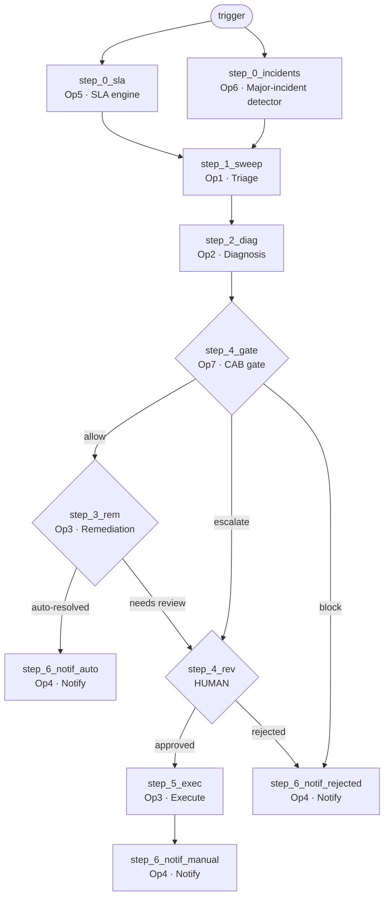

# Architecture — the Service Desk AI Employee

How the agent actually works, described from the live workflow definitions rather than from
intent. Every step id, input name and condition below is real and verifiable via
`GET /api/v1/workflows/{id}` on `auto-workflow-api.supervity.ai`.

---

## 1. Two layers, and why the split matters

```
┌──────────────────────────────────────────────────────────────┐
│  LAYER 1 — THE AGENT          runs on Supervity Auto         │
│  1 Orchestrator + 7 Operators. All delegation happens here.  │
└──────────────────────────────────────────────────────────────┘
                              ▲  multipart POST + SSE
                              │  (no webhooks — we drive it)
┌──────────────────────────────────────────────────────────────┐
│  LAYER 2 — THE COMMAND CENTER   FastAPI + Next.js + Postgres │
│  Policies · Insights · AI Manager · Data Manager · Workbench │
└──────────────────────────────────────────────────────────────┘
```

The agent decides and acts. The Command Center governs and records.

**The Command Center never orchestrates.** It triggers one workflow and watches. That
constraint is deliberate: Round 2 requires all orchestration on Auto, so the backend must not
chain operators itself.

**Auto never calls back.** There are no webhooks, and a Workflow API key cannot read run
history. So the SSE stream from a single `execute/stream` call is the only chance to capture
what happened — `agent_runs` and `operator_executions` are the sole record the dashboard,
Insights and audit trail will ever have.

---

## 2. Operator vs Orchestrator

An **Operator** does one job end to end: takes an input, does one unit of work, uses the
integrations that job needs, returns a result. One skilled worker, one responsibility.

An **Orchestrator** is an operator that runs other operators. It does no domain work itself. It
decides which operators to call and in what order, passes context between them, branches on
their results, and escalates to a human when a decision shouldn't be automated.

In Auto this is a `subworkflow_call` — the orchestrator step names a target `workflow_id` and
maps data in and out. Our orchestrator contains **zero** lines of code that talk to Supabase,
Outlook or Slack. Every external call is made by an operator.

> **The distinctness test.** Delete an operator on paper: if a specific business capability
> disappears, it was real. If nothing changes, it was a split for appearances.

---

## 3. The seven operators

| # | Operator | Does | Reads / writes | Key inputs |
|---|---|---|---|---|
| 1 | **Backlog Sweep & Triage** | Fetches the backlog, resolves VIP status, ranks by SLA risk | `issues`, `users_directory` | `priority_ranking_order`, `sla_thresholds` |
| 2 | **Diagnosis** | Matches a ticket to a KB article, checks provisioning, verifies routing | `issues`, `users_directory`, `knowledge_base`, `assets_access` + LLM | `issue_key`, `kb_confidence_threshold`, `stalled_days_threshold`, `routing_mapping_json` |
| 3 | **Safe Remediation** | Decides if a fix is *technically safe*; if so applies it and re-reads the row to verify | writes `issues` | 15 diagnostic fields from Op2 |
| 4 | **Requester Notification** | Tells the requester and the support team what happened | Outlook, Slack | `issue_key`, `outcome`, `escalation_reason`, … |
| 5 | **SLA & Business-Hours Engine** | Computes *true* SLA from working hours, regional timezone and holidays | `issues`, `users_directory`, `sla_calendar`, `team_roster` | `sla_targets`, `at_risk_window_minutes`, `as_of` |
| 6 | **Major-Incident Detector** | Correlates related tickets into incidents, sizes blast radius, separates recurring known errors | `issues`, `incident_problem_links`, `users_directory`, `team_roster` | `flood_threshold_count`, `recurring_error_min_count`, `as_of` |
| 7 | **Change / CAB Approval Gate** | Decides if a change is *permitted* to touch production | `change_requests` (read only) | `blocking_statuses`, `escalating_statuses`, `require_cab_for_risk` |

### Three that carry most of the weight

**Operator 5 exists because elapsed time lies.** A VIP ticket raised Friday 17:30 and checked
Monday 09:30 has burned 64 clock hours but only **60 business minutes**. Op5 resolves the
region from the *reporter* (`Reporter → users_directory.display_name → location →
sla_calendar.region` — the assignment group maps to three different regions and is unusable),
then counts only minutes inside the working window, skipping weekends and regional holidays.
Same ticket under Remote's 24×7 cover: **3,840 minutes and breached.** One ticket, two
calendars, opposite answers.

**Operator 6 separates an incident from noise.** 44 "Shared drive access" tickets over 23 days
is a *recurring known error* — write a KB article. 23 tickets in 9.5 hours all pointing at one
payroll outage is a *major incident* — declare it. It reconciles two independent linkage
mechanisms (`incident_problem_links` parent keys and `issues.linked_incident` labels) and flags
disagreement rather than silently trusting one.

**Operator 7 answers a different question from Operator 3.** Op3 asks *"is this fix safe?"*
Op7 asks *"are we allowed to make it?"* Both must pass. A change that was previously **Rolled
Back** is blocked outright — a fix that already failed must not be retried automatically.

---

## 4. The orchestrator

`IT Ticker Orchestrator` — 11 steps, 22 inputs, 7 operators, 3 branch points.



### Why the shape is what it is

**Op5 and Op6 run in parallel at the front.** Both appear in `start_at` with empty
`depends_on`; `step_1_sweep` depends on both. Genuine fan-out and fan-in at the orchestrator
level — they answer independent questions and neither needs the other's output.

**Op5 feeds triage.** Op1 ranks on Op5's computed business-hours SLA rather than the stale
`customfield_10030` label, which disagrees with reality on most tickets.

**The gate sits before remediation, not after.** Op3 *executes* when it judges a change safe —
its `execute_and_verify_update` step writes to Supabase. A gate placed downstream would be
approving a change that had already been applied. Op7 needs only `issue_key`, so it runs first.

**Two routes reach the human.** `step_4_gate → escalate` (needs CAB approval) and
`step_3_rem → cond_review` (technically unsafe or low confidence). Both land in `step_4_rev`,
which is why it depends only on `step_4_gate` — the common ancestor that runs on every path.
Depending on `step_3_rem` too made the escalate branch unreachable, since a gated ticket never
reaches remediation.

### Data flowing between steps

| variable | set by | carries |
|---|---|---|
| `sla_states` | step_0_sla | per-ticket computed SLA state, minutes to breach, breach instant |
| `incident_clusters` | step_0_incidents | clusters, duplicates, recurring known errors |
| `ticket_data` | step_1_sweep | the single selected ticket, plus `major_incident_key` if it belongs to one |
| `diag_result` | step_2_diag | KB match, confidence, routing verdict, provisioning status |
| `gate_result` | step_4_gate | decision, change_id, risk, approver, `policy_conflict`, `prior_rollback` |
| `rem_result` | step_3_rem | safety verdict and, when auto-resolved, the verified update |
| `rev_result` | step_4_rev | the human's decision and notes |
| `exec_result` | step_5_exec | the executed change and verification |

Every handoff re-checks `issue_key` and `row_id` and raises `DATA_INTEGRITY_ERROR` on a
mismatch, so a mapping error surfaces loudly instead of silently acting on the wrong ticket.

---

## 5. A real run — `ITSM-2180`

Triggered through the Command Center with `target_issue_key = ITSM-2180`:

```
t+  0s  POST /api/agent/runs               → 202, agent_runs row created
t+ 20s  step_0_sla ∥ step_0_incidents      → Op6 finds INC-9001: 23 tickets,
                                              21 reporters, 4 assignment groups
t+ 40s  step_1_sweep                       → selects ITSM-2180
t+ 60s  step_2_diag                        → diagnosis
t+100s  step_4_gate                        → ESCALATE
                                              CHG-0001, High risk, Pending CAB
        step_4_rev                         → PAUSED, awaiting a human
        step_3_rem                         → never ran. Nothing was touched.
```

The agent refused to modify production and handed the decision to a person, with the incident
context attached. That is the whole point of the build.

---

## 6. Governance — how a person controls it

The orchestrator's **22 inputs are the policy surface**. Each one is a row in `policies` keyed
to its Auto input name. The backend reads active policies on every run and passes their current
values as workflow inputs.

```
Policies page  →  policies table  →  POST /api/agent/runs  →  workflow inputs  →  agent behaviour
```

No code, no redeploy, effective on the next run. Examples:

| change this | and the agent | 
|---|---|
| `kb_confidence_threshold` 0.85 → 0.99 | stops auto-resolving; everything routes to the Workbench |
| `require_change_record_for_production` false → true | blocks any ticket without a change record (447 of 460) |
| `at_risk_window_minutes` 120 → 480 | flags far more tickets as at-risk, changing triage order |
| `flood_threshold_count` 5 → 30 | stops declaring INC-9001 a major incident |

Every evaluation is written to `policy_evaluations` with the threshold **as it was at decision
time**, so a decision can still be explained after someone changes the rule.

---

## 7. Verification

The three new operators are checked against fixtures of known-correct values, not eyeballed:

- [`round2-op5-test-fixture.md`](round2-op5-test-fixture.md) — 8 real tickets, exact business
  minutes, SLA state and breach instant
- [`round2-op6-test-fixture.md`](round2-op6-test-fixture.md) — 2 clusters, 3 duplicates,
  11 recurring known errors, **0 false major incidents**
- [`round2-op7-test-fixture.md`](round2-op7-test-fixture.md) — all 13 change records,
  5 escalate / 5 block / 3 allow

This mattered: across the three operators, **every defect found produced confident,
well-formatted, plausible output**. None threw an error. A summary once reported "5 tickets
processed, 3 auto-resolved" for a run in which the notification operator never executed once.
Fixtures are the only reason those were caught.
